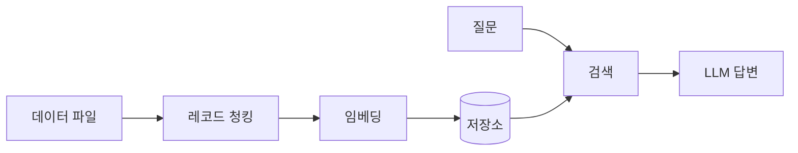

# 🤖 OBot

> 데이터 파일만 넣으면, API로 바로 쓰는 RAG 챗봇 서버

---

## 💭 문제 인식

RAG 챗봇 하나 만들려면 청킹, 임베딩, 벡터 DB, 프롬프트까지 매번 새로 짜야 했다
JSON이나 CSV는 글자 수로 자르면 데이터 한 건이 중간에 쪼개지고,
"제일 비싼 거 뭐야?" 같은 질문에는 답도 못 한다.

**이 문제를 해결하기 위해 직접 만들게 되었다.** 파일 넣고 실행하면 끝나는 챗봇 서버.
---
## ✨ 핵심 특징

| | |
|---|---|
| **파일 첨부 ** | JSON · JSONL · CSV 자동 처리 |
| **레코드 단위 청킹** | 데이터 한 건이 쪼개지지 않음 |
| **하이브리드 검색** | 의미 + 키워드 검색 (bge-m3) |
| **집계 질문 지원** | 자주 질문 되는 점 → SQL로 처리 |
| **LLM 자유 선택** | Ollama · Claude · GPT |
| **API 서버** | 어떤 프로젝트에서든 HTTP로 호출 |

---

## 🗺 파이프라인



---

## ⚙️ 설정

```yaml
# config.yaml
llm:
  provider: ollama   # ollama | anthropic | openai
  model: qwen2.5:7b
```

API 키는 `.env`에 입력. 임베딩 모델은 `bge-m3`로 고정.

---

## 🛠 기술 스택

| 구분 | 기술 |
|---|---|
| 서버 | Python, FastAPI, uv |
| 임베딩 | BAAI/bge-m3 |
| 저장소 | Qdrant (로컬), SQLite |
| LLM | Ollama / Anthropic / OpenAI |

---

## 📁 프로젝트 구조

```
obot/
├── src/obot/
│   ├── core/      # 로드, 청킹, 임베딩, 검색, 답변 생성
│   ├── llm/       # LLM provider 어댑터
│   └── api/       # FastAPI 서버
├── data/          # 사용자 데이터
├── examples/      # 샘플 데이터
└── config.yaml
```

---

## ✅ 개발 계획

- [ ] 설계: 요구사항, 설정 구조 확정
- [ ] 파일 로드 + 스키마 분석
- [ ] 레코드 단위 청킹 + bge-m3 임베딩
- [ ] 검색 + LLM 답변 생성
- [ ] FastAPI 서버 + 자동 빌드
- [ ] 하이브리드 검색 (dense + sparse)
- [ ] 집계 질문 SQL 처리
- [ ] Docker, 샘플 데이터, 데모 GIF

---

## 📚 참고

- Lewis et al., [Retrieval-Augmented Generation for Knowledge-Intensive NLP Tasks](https://arxiv.org/abs/2005.11401), NeurIPS 2020
- Chen et al., [BGE M3-Embedding](https://arxiv.org/abs/2402.03216), 2024
- [FastAPI 공식 문서](https://fastapi.tiangolo.com)
- [BAAI/bge-m3](https://huggingface.co/BAAI/bge-m3)

---

## 📄 License

MIT
